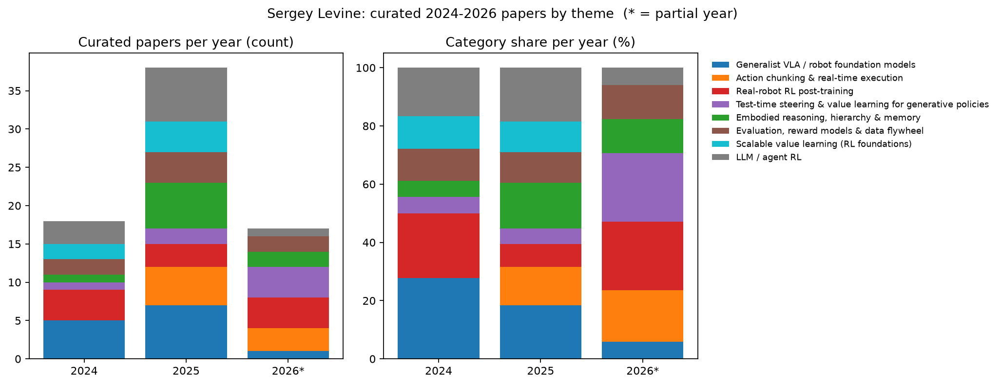
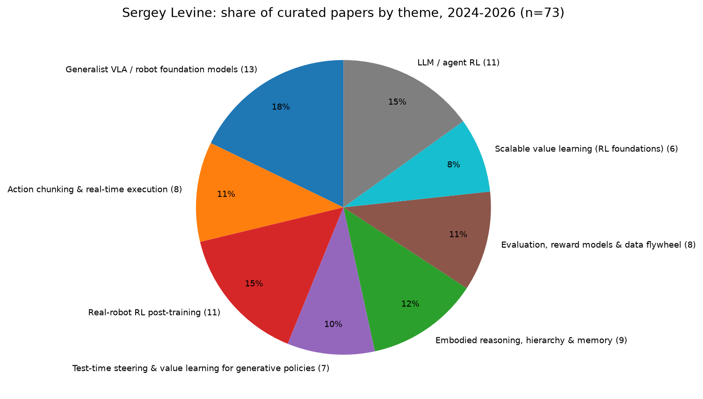
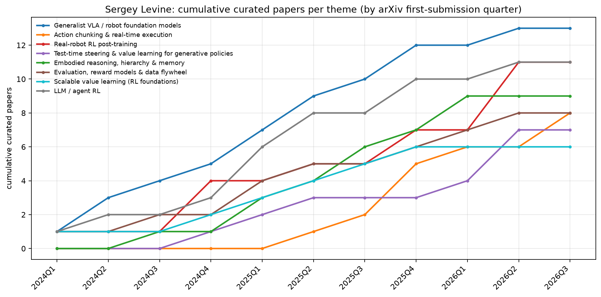
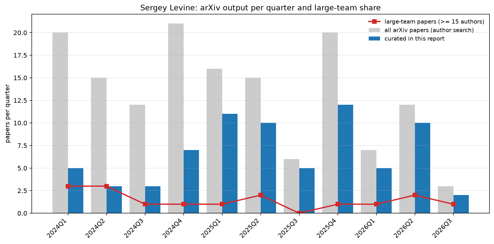
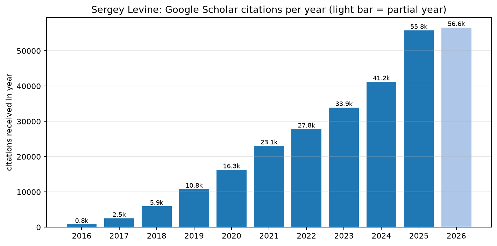

# Sergey Levine：近期研究趋势分析（2024–2026）

> 更新时间：2026-09-05  
> Google Scholar（按时间排序）：[Sergey Levine](https://scholar.google.com/citations?hl=en&user=8R35rCwAAAAJ&view_op=list_works&sortby=pubdate)  
> arXiv 作者检索：[Levine, Sergey](https://arxiv.org/search/?query=Levine%2C+Sergey&searchtype=author&order=-announced_date_first)

> 方法说明：本文引用的每一篇论文都通过 arXiv 作者检索（`au:Levine_Sergey`）与 Google Scholar 按日期排序的列表交叉核对过，标题、作者位、arXiv 编号一致；所有链接均指向 arXiv 摘要页。分类数据见同目录 [`papers.csv`](papers.csv)，原始检索结果见 [`arxiv_papers.json`](arxiv_papers.json)，图表由项目 skill `researcher-trend-analysis` 的 `plot_trends.py` 生成。趋势判断以论文摘要中明确陈述的内容为依据，个人推断部分单独标出。

---

## 一句话结论

Sergey Levine 在 2024–2026 年的工作，是把机器人学习从"为单个任务训练一个策略"推进为一个可规模化、可持续改进的**通用机器人学习栈**：先用异构机器人数据、网络数据和语言训练 VLA / generalist policy（π0 → π0.5 → π\*0.6 → π0.7），再用 **RL 后训练、价值引导、可操控接口（steerability）、记忆和评估基础设施** 让它在真实部署中变得精确、快速、可靠并能从经验中学习。

可以把他的核心问题概括为：

> 如何构建一个能力足够广、可以被精确操控、并且能在部署后持续从自身经验中改进的通用机器人策略？

---

## 数据速览（图表）

以下图表由 [`papers.csv`](papers.csv)（73 篇精选论文的分类）、[`arxiv_papers.json`](arxiv_papers.json)（2024 年以来 Levine 署名的全部 147 篇 arXiv 论文）和 [`scholar_citations.csv`](scholar_citations.csv)（Google Scholar 每年被引数，2026-09-05 抄录）生成。年份以 arXiv **首次提交日期**为准；2026 年只覆盖到 8 月，标为 `2026*`。

### 图 1 · 各主题论文数量与占比

| 主题 | 2024 | 2025 | 2026* | 合计 |
|---|---|---|---|---|
| 通用机器人基础模型（VLA） | 5 | 7 | 1 | 13 |
| 动作分块与实时执行 | 0 | 5 | 3 | 8 |
| 真实机器人 RL 后训练 | 4 | 3 | 4 | 11 |
| 生成式策略的测试时引导与价值学习 | 1 | 2 | 4 | 7 |
| 具身推理、层级控制与记忆 | 1 | 6 | 2 | 9 |
| 评估、奖励模型与数据飞轮 | 2 | 4 | 2 | 8 |
| 可扩展价值学习（算法基础） | 2 | 4 | 0 | 6 |
| LLM 与智能体 RL | 3 | 7 | 1 | 11 |
| **合计** | 18 | 38 | 17 | 73 |

解读：

- **2024 年的重心是"把 generalist 建起来"**：VLA / 数据集类占 28%（DROID、Octo、OpenVLA、CrossFormer、π0），加上 SERL / HIL-SERL 这批真实机器人 RL 系统。
- **2025 年是"往 generalist 上加东西"的一年**：具身推理与层级（Hi Robot、Efficient Embodied Reasoning）、评估基础设施（AutoEval、RoboArena、PolaRiS）、动作分块与实时执行（RTC、Q-chunking）同时爆发，主题最分散。
- **2026 年（截至 8 月）明显收敛到"改进已有 generalist"**：RL 后训练（RL Token、OGPO、SARL）+ 测试时引导（QGF、FRS、RQL、QAM）合计占 47%，而新的 VLA 基础模型论文只有 π0.7 一篇。个人推断：这与 Physical Intelligence 的 π 系列已经成熟、研究重心转向"如何让它在部署中持续变好"一致。
- LLM / 智能体 RL 在 2025 年达到 7 篇，说明该组在 LLM 侧的投入并非点缀，而是与机器人侧并行的一条线。

### 图 2 · 主题占比（2024–2026 合计）

解读：在 73 篇精选论文中，与"改进已有策略"直接相关的三类（RL 后训练 15%、测试时引导 10%、动作分块与实时执行 11%）合计 36%，已经超过 VLA 基础模型本身（18%）。这支持本文的核心判断：Levine 组的重心已从"训练一个 generalist"转向"让 generalist 可靠、快速并持续改进"。

### 图 3 · 各主题累计曲线（按季度）

解读：

- **VLA 基础模型**（蓝）是唯一从 2024Q1 起就持续、平稳增长的主题，说明它是贯穿全程的主线。
- **动作分块与实时执行**（橙）在 2025Q2 之前为零，之后陡升——RTC（2025Q2）是拐点，随后 Q-chunking、Decoupled Q-chunking、ARLI 接连出现。这说明"大模型延迟"是随着 π 系列部署才浮现出来的问题。
- **测试时引导**（紫）在 2026Q2 出现跳跃（QGF、FRS、RQL 同季度提交），是 2026 年最集中的新方向。
- **RL 后训练**（红）呈阶梯式：2024Q4 一波（HIL-SERL、RLDG、WSRL），2026Q2 再一波（RL Token、OGPO、SARL），中间以 DSRL 等零星工作衔接。
- **可扩展价值学习**（青）在 2025Q4 之后没有新增，个人推断：这条线的结论（horizon、UTD、compute-optimal）已经基本给出，后续更多以"被引用"的方式出现在 1C/1D 的方法中。

### 图 4 · arXiv 总产出与大团队论文比例

解读：

- 灰色为作者检索得到的全部 arXiv 论文，蓝色为本文精选。2024 年每季度 12–21 篇，2025 年 6–20 篇，2026 年前三季度 7 / 12 / 3 篇。2026 年总产出下降的部分原因是 Q3 只统计到 8 月，且 arXiv 收录有滞后；但 Q1 只有 7 篇是实际现象，值得在后续更新时观察是否持续。
- 红线是 ≥ 15 位作者的"大团队"论文（基本对应 Physical Intelligence 与多机构合作数据集），每季度 0–3 篇，占比不高但都是标志性系统工作（DROID、π0、π0.5、π\*0.6、π0.7、RoboArena、ARLI）。
- 精选比例在 2025Q1 之后明显提高（2025Q1 达 11/16），说明 Levine 的产出从 2025 年起更集中于本文关注的机器人学习主线，非机器人的杂项（科学设计、优化器、专利等）减少。

### 图 5 · Google Scholar 每年被引数

解读：2025 年被引 55.8k，比 2024 年（41.2k）增长 35%；2026 年截至 9 月初已达 56.6k，已超过 2025 全年（个人推断：按当前速度全年可能超过 8 万）。总被引 276,448，h-index 211（Scholar，2026-09-05）。增长最快的近期论文按 Scholar 引用数排序：π0.5（1352）、π\*0.6（216）、RTC（175）、DSRL（157）、Knowledge Insulation（115）、Q-chunking（100）——全部是 2025 年的 VLA / 部署相关工作，与图 1 的主题转移一致。

---

## 1. 2024–2026 论文全景（按主题分组）

下面按主题列出核心论文（共 73 篇，从 2024 年以来 Levine 署名的 147 篇 arXiv 论文中筛选）。每个主题先用几句话说明它在研究什么，再给出论文表；每个主题的逐篇分析、演进脉络与深度讨论见 [`categories/`](categories/) 目录下对应文件。每篇给出年份、arXiv 链接和一句话要点。带 † 的论文是 Physical Intelligence 团队署名的大型系统工作（通常 ≥ 15 位作者）。主题分类沿用项目统一的分类表（见 `.cursor/skills/researcher-trend-analysis/CATEGORIES.md`）。

### 1A. 通用机器人基础模型（Generalist policy / VLA）

**这一类在研究什么：** VLA（Vision-Language-Action）以预训练视觉语言模型为主干、接一个动作头，把图像和语言指令直接映射为机器人动作。核心问题：能否用多机器人、网络数据甚至人类视频训练**一个**策略控制很多机器人；动作用离散 token 还是连续 flow 生成；加动作头时如何不破坏 VLM 知识；能泛化到什么程度。它决定了机器人学习能否走上"预训练 + 微调"的路线。→ 深度分析：[categories/generalist-vla.md](categories/generalist-vla.md)

| 年份 | 论文 | 要点 |
|---|---|---|
| 2024 | [DROID](https://arxiv.org/abs/2403.12945) | 76k 轨迹、564 个场景、84 个任务的分布式真实操作数据集，为 generalist 训练提供多样性。 |
| 2024 | [Octo](https://arxiv.org/abs/2405.12213) | 基于 Open X-Embodiment 800k 轨迹的开源 transformer generalist policy，强调易于微调到新机器人。 |
| 2024 | [OpenVLA](https://arxiv.org/abs/2406.09246) | 7B 开源 VLA（Llama 2 + DINOv2/SigLIP），系统研究 VLA 的高效微调。 |
| 2024 | [CrossFormer](https://arxiv.org/abs/2408.11812) | 一套权重控制 20 种 embodiment（操作、导航、腿足、飞行），900K 轨迹。 |
| 2024 | [π0](https://arxiv.org/abs/2410.24164) † | 在预训练 VLM 上加 flow-matching 动作生成，跨多种灵巧机器人平台训练。VLA 从自回归离散 token 转向连续 flow 动作头。 |
| 2025 | [FAST](https://arxiv.org/abs/2501.09747) † | 基于 DCT 的压缩式动作 tokenization，使自回归 VLA 能学高频灵巧任务。 |
| 2025 | [FuSe (Beyond Sight)](https://arxiv.org/abs/2501.04693) | 用语言作为跨模态 grounding，把触觉、音频等异构传感器微调进 generalist policy。 |
| 2025 | [π0.5](https://arxiv.org/abs/2504.16054) † | 多机器人数据 + 高层语义预测 + 网络数据联合训练；首次展示端到端系统在**完全未见过的家庭**中完成清理厨房/卧室等长时域任务。 |
| 2025 | [Knowledge Insulation](https://arxiv.org/abs/2505.23705) † | 研究在 VLM 主干上加入连续动作专家时如何保护预训练知识，实现"训练快、推理快、泛化更好"。 |
| 2025 | [OmniVLA](https://arxiv.org/abs/2509.19480) | 导航 VLA 支持 2D 位姿、图像、语言三种目标模态及其组合。 |
| 2025 | [π\*0.6: a VLA That Learns From Experience](https://arxiv.org/abs/2511.14759) † | 提出 RECAP（advantage-conditioned policy 的 RL），先用离线 RL 预训练 generalist，再通过在机器人上的自主采集 + 专家干预持续改进；真实家庭叠衣、装箱、做咖啡。 |
| 2025 | [Emergence of Human-to-Robot Transfer](https://arxiv.org/abs/2512.22414) | 简单的人类视频联合训练配方；当 VLA 预训练覆盖足够多场景/任务/embodiment 后，人→机器人迁移能力**涌现**。 |
| 2026 | [π0.7](https://arxiv.org/abs/2604.15483) † | 核心思想是训练时的**多样化上下文条件化**：不仅条件于语言指令，还条件于任务表现元数据、子目标图像等，使模型可被精确操控；能利用示范、次优/失败的自主数据和非机器人数据；零样本跨 embodiment 叠衣，开箱即用操作咖啡机的水平接近专门 RL 微调的模型。 |

### 1B. 动作分块与实时执行（Action chunking / real-time execution）

**这一类在研究什么：** Action chunking 指策略一次预测未来一段动作序列而非单步动作。它从模仿学习的工程技巧变成独立研究对象：为什么有效、如何带进 RL、以及当 VLA 推理一次要几百毫秒时如何边执行边生成而不停顿抖动。核心矛盾是**模型规模与控制频率的冲突**。→ 深度分析：[categories/chunking-realtime.md](categories/chunking-realtime.md)

| 年份 | 论文 | 要点 |
|---|---|---|
| 2025 | [Real-Time Chunking (RTC)](https://arxiv.org/abs/2506.07339) † | 推理时算法：执行当前 chunk 的同时生成下一个 chunk，"冻结"必然执行的动作并 inpaint 其余部分；适用于任何 diffusion/flow VLA，无需重训。 |
| 2025 | [Training-Time Action Conditioning for RTC](https://arxiv.org/abs/2512.05964) † | 在训练时模拟推理延迟并直接条件于动作前缀，消除推理时开销；在 π0.6 上做装箱和咖啡实验。 |
| 2025 | [Q-chunking](https://arxiv.org/abs/2507.07969) | 把 action chunking 引入 TD-based RL，在 chunked 动作空间中做 RL，改善长时域稀疏奖励下的探索与样本效率。 |
| 2025 | [Decoupled Q-Chunking](https://arxiv.org/abs/2512.10926) | 让 critic 的 chunk 长度与 policy 的 chunk 长度解耦：critic 用长 chunk 加速价值回传，policy 用短 chunk 保持反应性。 |
| 2025 | [Scalable Offline MBRL with Action Chunks](https://arxiv.org/abs/2512.08108) | 动作分块的动力学模型（从动作序列预测未来状态）减少 model-based value expansion 的复合误差。 |
| 2026 | [AsyncVLA](https://arxiv.org/abs/2602.13476) | 大模型远程给高层引导，轻量 onboard Edge Adapter 高频修正动作，解耦语义推理与反应执行。 |
| 2026 | [Why Does Action Chunking Improve BC?](https://arxiv.org/abs/2608.02547) | 实验证明常见解释（时间一致性、horizon 缩短、表征学习）不成立；真正原因是**非马尔可夫表达力**与更低的复合误差，且在很多场景下"延迟策略"就能捕获这一效果。 |
| 2026 | [ARLI: Learning to Act While Waiting](https://arxiv.org/abs/2608.23831) † | 大型 VLA 的推理延迟会改变有效环境动力学、破坏马尔可夫假设，使标准 RL 完全失效；提出延迟感知的异步 RL 框架。 |

### 1C. 通用策略的 RL 后训练（真实机器人）

**这一类在研究什么：** 示范训练出的策略"会做但不够好"；RL 后训练让它在真实机器人上通过试错继续改进。难点是样本效率与大模型上的稳定性，因此论文围绕：在哪个空间做 RL（原始动作、潜噪声、紧凑读出表征、语言 prompt）、奖励从哪来、怎样预训练才是好的 RL 初始化、微调后如何不遗忘。→ 深度分析：[categories/rl-posttraining.md](categories/rl-posttraining.md)

| 年份 | 论文 | 要点 |
|---|---|---|
| 2024 | [SERL](https://arxiv.org/abs/2401.16013) | 样本高效真实机器人 RL 软件栈，强调实现细节与算法同样重要。 |
| 2024 | [HIL-SERL](https://arxiv.org/abs/2410.21845)（Science Robotics 2025） | 人在环视觉 RL：示范 + 人工纠正 + 高效 RL，1–2.5 小时内在动态操作、精密装配、双臂协调任务上达到接近 100% 成功率。 |
| 2024 | [RLDG](https://arxiv.org/abs/2412.09858) | 用 RL 生成高质量数据来微调 generalist policy，比人类示范微调成功率高至多 40%。 |
| 2024 | [WSRL](https://arxiv.org/abs/2412.07762) | 在线 RL 微调离线 RL 初始化时**不必保留离线数据**，前提是在线算法设计正确。 |
| 2025 | [DSRL](https://arxiv.org/abs/2506.15799) | 在 diffusion policy 的**潜在噪声空间**做 RL 来操控 BC 策略，实现快速真实世界自主改进。 |
| 2025 | [Posterior Behavioral Cloning](https://arxiv.org/abs/2512.16911) | 反向思考：如何预训练 BC 策略，使其成为**适合 RL 微调的初始化**。 |
| 2025 | [Robust Finetuning via Parameter Merging](https://arxiv.org/abs/2512.08333) | 微调新任务时保留 generalist 的广泛能力，避免过拟合到少量示范。 |
| 2025 | [π\*0.6 / RECAP](https://arxiv.org/abs/2511.14759) † | 见 1A：离线 RL 预训练 + advantage conditioning + 部署数据与专家干预。 |
| 2026 | [RL Token](https://arxiv.org/abs/2604.23073) † | 让 VLA 暴露一个紧凑的"RL token"读出表征，在其上训练小型 actor–critic 头；4 个真实任务（拧螺丝、扎带、充电器插入、网线插入）上，数分钟到数小时练习使最难阶段速度提升至 3×，部分任务超过人类遥操作速度。 |
| 2026 | [OGPO](https://arxiv.org/abs/2605.03065) | 对 diffusion/flow 生成式策略做样本高效的**全参数**微调：离线 critic + 穿过完整生成过程的改进 PPO 目标；能把初始化很差的 BC 策略微调到接近全成功。 |
| 2026 | [SARL: Semantic RL](https://arxiv.org/abs/2606.31958) | 不在动作空间做 RL，而是通过在线交互优化**语言 prompt 空间**，把 generalist policy 当作可控技能先验来组合已有技能，解决超出零样本能力的长时域任务。 |
| 2026 | [Process Rewards via Success Visitation Matching](https://arxiv.org/abs/2606.23640) | 训练判别器区分成功/失败 episode，把稀疏 0/1 结果奖励转换为稠密过程奖励。 |

### 1D. 生成式策略的测试时引导与价值学习

**这一类在研究什么：** 现代策略多是 diffusion / flow 生成模型，如何用**价值函数**改进它们？对多步去噪反传梯度不稳定是共同障碍。两条路：训练时设计新目标绕开反传（FQL、CFGRL、QAM、RQL）；或**测试时**用价值重排序、梯度引导、噪声空间搜索，完全不重训策略（V-GPS、QGF、FRS）——与 LLM 的"生成器 + 验证器"同构。→ 深度分析：[categories/test-time-steering.md](categories/test-time-steering.md)

| 年份 | 论文 | 要点 |
|---|---|---|
| 2024 | [V-GPS: Steering Your Generalists](https://arxiv.org/abs/2410.13816) | 部署时用离线 RL 学到的价值函数对 generalist 的候选动作**重排序**，无需重训策略。 |
| 2025 | [Flow Q-Learning](https://arxiv.org/abs/2502.02538) | 用 RL 训练一个 one-step 策略而非直接引导迭代 flow，避免递归反传不稳定。 |
| 2025 | [CFGRL: Diffusion Guidance Is a Policy Improvement Operator](https://arxiv.org/abs/2505.23458) | 推导 diffusion guidance 与策略改进的直接关系；guidance 权重越大性能越高，且可不显式学价值函数。 |
| 2026 | [Q-learning with Adjoint Matching](https://arxiv.org/abs/2601.14234) | 借用生成建模的 adjoint matching，稳定地利用 critic 一阶梯度优化 flow/diffusion 策略。 |
| 2026 | [QGF: Test-Time Gradient Guidance of Flow Policies](https://arxiv.org/abs/2606.11087) | 只在测试时用价值梯度引导 BC 训练的 flow 策略，策略优化完全在推理时完成；随模型规模扩展稳定，成本远低于训练时 RL。 |
| 2026 | [Flow Reversal Steering (FRS)](https://arxiv.org/abs/2606.13675) | 把次优但"合理"的动作反向通过 flow 找到其潜噪声，再映射到附近的 generalist 动作模式；可把人类/VLM 的粗粒度语义引导转成好动作。 |
| 2026 | [Reversal Q-Learning](https://arxiv.org/abs/2606.17551) | 把 flow 的每个精炼步视为扩展 MDP 中的动作，通过"反转"flow 生成虚拟 on-policy 轨迹，实现离策略 flow-policy RL。 |

### 1E. 具身推理、层级控制、可操控接口与记忆

**这一类在研究什么：** 让机器人完成几分钟到十几分钟的长任务，需要行动前的具身推理、VLM 高层 + VLA 低层的层级结构及足够丰富的层间接口（子任务、运动、像素坐标、子目标图像）、多尺度记忆，以及在上下文中学习低层能力与调整策略。核心是**如何把 VLA 组织成一个多层级、有记忆、可操控的系统**。→ 深度分析：[categories/reasoning-hierarchy-memory.md](categories/reasoning-hierarchy-memory.md)

| 年份 | 论文 | 要点 |
|---|---|---|
| 2024 | [Embodied Chain-of-Thought (ECoT)](https://arxiv.org/abs/2407.08693) | 让 VLA 在行动前对任务、子任务、物体与 grounded 特征做多步推理，提升泛化。 |
| 2025 | [Hi Robot](https://arxiv.org/abs/2502.19417) † | 层级 VLM：高层对复杂 prompt 和用户反馈推理出下一步，低层 VLA 执行；能处理"帮我做个素食三明治"这类开放指令。 |
| 2025 | [Training Strategies for Efficient Embodied Reasoning](https://arxiv.org/abs/2505.08243) † | 拆解机器人 CoT 为何有效（表征学习、课程化、表达力），设计不需专门推理数据且推理更快的变体。 |
| 2025 | [Reflective Planning](https://arxiv.org/abs/2502.16707) | 测试时计算框架：用生成模型想象未来世界状态，反思并修正 VLM 的多阶段操作规划。 |
| 2025 | [Behavioral Exploration](https://arxiv.org/abs/2507.09041) | 训练长上下文生成模型，在专家行为空间中学会"上下文内探索与适应"。 |
| 2025 | [CAST](https://arxiv.org/abs/2508.13446)（RA-L 2026） | 用 VLM 生成反事实语言标签扩充数据，提升 VLA 的细粒度指令跟随。 |
| 2025 | [LITEN: Learning Affordances at Inference-Time](https://arxiv.org/abs/2510.19752) | 高层 VLM 通过在上下文中纳入过去执行结果，学习低层 VLA 的 affordance；推理—执行—评估迭代。 |
| 2026 | [Steerable Policies](https://arxiv.org/abs/2602.13193) † | 用多抽象层级的合成指令（子任务、运动、像素坐标）训练 VLA，使 VLM 的推理能真正操控低层行为，而不只通过自然语言任务指令。 |
| 2026 | [MEM: Multi-Scale Embodied Memory](https://arxiv.org/abs/2603.03596) † | 视频编码的短期记忆 + 文本长期记忆，支持长达 15 分钟的任务（清理厨房、做三明治）；记忆使策略能在上下文中调整操作策略。 |

### 1F. 评估、奖励模型与数据飞轮

**这一类在研究什么：** 通用策略的评估慢、贵、难复现。这类论文建设基础设施：自主数据收集车队、24 小时评估站、分布式双盲对比、real-to-sim 仿真评估、视频世界模型评估器，以及通用视觉语言**奖励模型**。它们构成"部署 → 评估 → 奖励与失败数据 → 再训练"的**数据飞轮**。→ 深度分析：[categories/eval-reward-data.md](categories/eval-reward-data.md)

| 年份 | 论文 | 要点 |
|---|---|---|
| 2024 | [AutoRT](https://arxiv.org/abs/2401.12963) | 用 VLM/LLM 编排机器人车队在未见场景中自主收集数据。 |
| 2024 | [SOAR: Autonomous Improvement of Instruction Following](https://arxiv.org/abs/2407.20635) | 用 VLM 收集并评估语义任务，从无标注自主数据中改进指令跟随策略。 |
| 2025 | [AutoEval](https://arxiv.org/abs/2503.24278) | 像集群调度系统一样提交评估任务，24 小时自主评估 generalist policy。 |
| 2025 | [ViVa](https://arxiv.org/abs/2503.18210) | 从互联网视频、失败数据等学习目标条件价值函数来引导在线 RL。 |
| 2025 | [RoboArena](https://arxiv.org/abs/2506.18123) | 分布式众包、双盲配对评估 generalist policy，让评估者自选任务与环境。 |
| 2025 | [PolaRiS](https://arxiv.org/abs/2512.16881) | real-to-sim 环境重建，规模化仿真评估 generalist policy。 |
| 2026 | [RoboReward](https://arxiv.org/abs/2601.00675) | 基于 OXE + RoboArena 的机器人奖励数据集与 4B/8B 视觉语言奖励模型；用反事实重标注和时间裁剪生成校准的负例/near-miss。 |
| 2026 | [SC3-Eval](https://arxiv.org/abs/2606.18610) | 把预训练视频基础模型改造成策略评估器（动作条件视频世界模型），用前向—逆向动力学一致性等约束抑制漂移。 |

### 1G. 可扩展价值学习（算法基础）

**这一类在研究什么：** 纯 RL 算法研究：价值函数能否像语言模型一样随数据、算力、模型规模**可预测地**变好？包括分类损失替代回归、UTD 与模型大小的算力分配、长 horizon 为何是扩展障碍、分治式价值更新以及 OGBench 基准。1C / 1D 中所有"用价值改进 generalist"的方法都依赖这里的结论。→ 深度分析：[categories/scalable-value-learning.md](categories/scalable-value-learning.md)

| 年份 | 论文 | 要点 |
|---|---|---|
| 2024 | [Stop Regressing](https://arxiv.org/abs/2403.03950) | 用分类交叉熵替代回归训练价值函数，显著改善大网络下的可扩展性。 |
| 2024 | [OGBench](https://arxiv.org/abs/2410.20092) | 离线目标条件 RL 基准：8 类环境、85 个数据集，考察 stitching、长时域推理等。 |
| 2025 | [Value-Based Deep RL Scales Predictably](https://arxiv.org/abs/2502.04327) | 数据与算力需求位于由 UTD 比控制的 Pareto 前沿，可从小规模实验外推。 |
| 2025 | [Horizon Reduction Makes RL Scalable](https://arxiv.org/abs/2506.04168) | 用比常规大 1000× 的数据集验证：horizon 是离线 RL 扩展的根本障碍。 |
| 2025 | [Compute-Optimal Scaling for Value-Based Deep RL](https://arxiv.org/abs/2508.14881) | 模型容量 vs UTD 的算力分配；发现 TD-overfitting 现象。 |
| 2025 | [Transitive RL](https://arxiv.org/abs/2510.22512) | 利用目标条件 RL 的三角不等式做分治式价值更新，递归深度 \(O(\log T)\)。 |

### 1H. LLM / 智能体 RL（AI 侧的平行线）

**这一类在研究什么：** 把 RL 用于 LLM / VLM 智能体：多轮对话、网页与手机操作、工具使用、数学推理。方法论与机器人侧高度平行——RL 比 SFT 更泛化、验证器驱动的测试时计算更优、在语言空间做 actor–critic、自生成训练任务。对照 1C / 1D 可以看到同一组在两个领域之间的思想迁移。→ 深度分析：[categories/llm-agent-rl.md](categories/llm-agent-rl.md)

| 年份 | 论文 | 要点 |
|---|---|---|
| 2024 | [ArCHer](https://arxiv.org/abs/2402.19446) | 层级多轮 RL 训练 LLM agent。 |
| 2024 | [DigiRL](https://arxiv.org/abs/2406.11896) / [Digi-Q](https://arxiv.org/abs/2502.15760) | 设备控制 agent 的自主 RL 与 VLM Q 函数。 |
| 2024 | [PAE](https://arxiv.org/abs/2412.13194) | 提议者—执行者—评估者结构，自主发现互联网 agent 技能。 |
| 2025 | [SFT Memorizes, RL Generalizes](https://arxiv.org/abs/2501.17161) | 结果奖励 RL 在文本与视觉规则变体上泛化，SFT 倾向记忆。 |
| 2025 | [Scaling Test-Time Compute Without Verification or RL is Suboptimal](https://arxiv.org/abs/2502.12118) | 证明基于验证器的 RL/搜索优于蒸馏搜索轨迹的无验证器方法。 |
| 2025 | [Intuitor: Learning to Reason without External Rewards](https://arxiv.org/abs/2505.19590) | 用模型自身的 self-certainty 作为唯一奖励替代 GRPO 的外部奖励。 |
| 2025 | [Self-Challenging Agents](https://arxiv.org/abs/2506.01716)、[NLAC](https://arxiv.org/abs/2512.04601)、[ZIP](https://arxiv.org/abs/2512.01457) | 自生成任务、语言空间 actor–critic、零开销自省以自适应分配测试时算力。 |
| 2026 | [VIMPO](https://arxiv.org/abs/2606.20008) | 面向 LLM 的价值隐式策略优化。 |

---

## 2. 主要趋势

### 2.1 VLA 已从"基础策略"演进为"可操控的基础模型"

从 π0（2024.10）到 π0.7（2026.04）的谱系可以看到 VLA 的角色变化：

| 版本 | 核心增量 |
|---|---|
| [π0](https://arxiv.org/abs/2410.24164) | VLM 主干 + flow-matching 连续动作；跨平台灵巧任务。 |
| [π0.5](https://arxiv.org/abs/2504.16054) | 异构任务联合训练（多机器人、语义子任务预测、网络数据），在未见家庭中泛化。 |
| [π\*0.6](https://arxiv.org/abs/2511.14759) | 离线 RL 预训练 + advantage conditioning，从部署经验与专家干预中改进。 |
| [π0.7](https://arxiv.org/abs/2604.15483) | 多样化上下文条件化（表现元数据、子目标图像、策略方式），可被精确操控；零样本跨 embodiment；开箱性能接近 RL 微调模型。 |

这条线的关键转变是：**通用性不再仅由参数承载，而由 prompt 中的多模态条件（语言、子目标图像、表现标签）共同决定**。π0.7 摘要明确把"steerable"作为标题关键词，[Steerable Policies](https://arxiv.org/abs/2602.13193) 则从接口层面论证：VLM 与 VLA 之间只用自然语言任务指令会"根本性地限制 VLM 推理对低层行为的操控"，因此需要子任务、运动、像素坐标等多层级指令。

配套的基础研究包括：动作表示（[FAST](https://arxiv.org/abs/2501.09747)）、如何在加动作头时保护 VLM 知识（[Knowledge Insulation](https://arxiv.org/abs/2505.23705)）、跨 embodiment 与人类视频的迁移何时涌现（[CrossFormer](https://arxiv.org/abs/2408.11812)、[Human-to-Robot Transfer](https://arxiv.org/abs/2512.22414)）。

### 2.2 从行为克隆转向"预训练 + RL 后训练"，且 RL 已进入真实机器人

这是 2024–2026 年最密集的一条线。RL 的位置发生了根本改变：不再从零学任务，而是位于预训练之后，负责精度、速度、恢复行为和对具体硬件的适配。

- **系统层面**：[HIL-SERL](https://arxiv.org/abs/2410.21845) 用 1–2.5 小时达到接近完美成功率；[RLDG](https://arxiv.org/abs/2412.09858) 用 RL 数据反哺 generalist；[π\*0.6](https://arxiv.org/abs/2511.14759) 把 RL 做进了 generalist VLA 的预训练与部署闭环；[RL Token](https://arxiv.org/abs/2604.23073) 用几小时真实练习把最难阶段速度提到 3×。
- **在什么空间做 RL**：动作空间（HIL-SERL、OGPO）、潜噪声空间（[DSRL](https://arxiv.org/abs/2506.15799)）、紧凑读出表征（RL Token）、语言 prompt 空间（[SARL](https://arxiv.org/abs/2606.31958)）。趋势是**把 RL 放到一个更小、更结构化、更贴近预训练先验的空间中**，以换取样本效率和稳定性。
- **为 RL 准备好的预训练**：[Posterior BC](https://arxiv.org/abs/2512.16911) 反过来问"怎样预训练才是好的 RL 初始化"；[WSRL](https://arxiv.org/abs/2412.07762) 表明在线微调可以不保留离线数据；[Parameter Merging](https://arxiv.org/abs/2512.08333) 解决微调后丢失通用能力的问题。
- **奖励来源**：[RoboReward](https://arxiv.org/abs/2601.00675) 训练通用视觉语言奖励模型；[Success Visitation Matching](https://arxiv.org/abs/2606.23640) 把稀疏结果奖励变成稠密过程奖励；[ViVa](https://arxiv.org/abs/2503.18210) 从视频学价值。

总体范式：

\[
\text{VLA/BC prior} + \text{value or reward feedback} + \text{online/post-training RL in a structured space}.
\]

### 2.3 生成式策略 + 价值函数：训练时 RL 与测试时引导两条并行路线

flow / diffusion 策略在 BC 下扩展稳定，但接入 RL 困难（穿过多步去噪反传不稳定）。Levine 组在 2025–2026 年同时推进两条路线：

- **训练时**：[FQL](https://arxiv.org/abs/2502.02538)（蒸馏 one-step 策略）、[QAM](https://arxiv.org/abs/2601.14234)（adjoint matching 稳定利用 critic 梯度）、[RQL](https://arxiv.org/abs/2606.17551)（把去噪步视作 MDP 动作）、[OGPO](https://arxiv.org/abs/2605.03065)（全参数微调）。
- **测试时**：[V-GPS](https://arxiv.org/abs/2410.13816)（价值重排序）、[CFGRL](https://arxiv.org/abs/2505.23458)（guidance 权重即策略改进）、[QGF](https://arxiv.org/abs/2606.11087)（价值梯度引导，策略优化完全在推理时完成）、[FRS](https://arxiv.org/abs/2606.13675)（反向 flow 把粗糙动作映射到好的模式）。

QGF 摘要中的论点值得注意：**"仅靠测试时的策略改进、保持监督训练不变"能与最先进的训练时算法竞争，且因为避开 actor–critic 不稳定性而随模型规模扩展更好**。这与 LLM 侧"生成器 + 验证器"的测试时计算范式是同构的：

\[
\text{candidate generation} \rightarrow
\text{value/reward/verifier} \rightarrow
\text{selection or guidance}.
\]

### 2.4 Action chunking 与实时执行成为一等研究对象

action chunking 从 imitation learning 的工程技巧变成了一个被系统研究的问题：

- **为什么有效**：[Why Does Action Chunking Improve BC?](https://arxiv.org/abs/2608.02547) 否定了时间一致性、horizon 缩短、表征学习等流行解释，指出关键是非马尔可夫表达力与更低的复合误差。
- **如何把它带进 RL**：[Q-chunking](https://arxiv.org/abs/2507.07969)、[Decoupled Q-Chunking](https://arxiv.org/abs/2512.10926)、[Scalable Offline MBRL with Action Chunks](https://arxiv.org/abs/2512.08108)。
- **如何在大模型延迟下执行**：[RTC](https://arxiv.org/abs/2506.07339) → [Training-Time RTC](https://arxiv.org/abs/2512.05964) → [AsyncVLA](https://arxiv.org/abs/2602.13476) → [ARLI](https://arxiv.org/abs/2608.23831)。ARLI 指出推理延迟会改变有效动力学、破坏马尔可夫假设，使标准 RL"完全失效"，说明**延迟已经成为 RL 后训练大型 VLA 的核心障碍**。

这意味着未来的 VLA 很可能不是单一频率、单一表示的端到端策略，而是一个多时间尺度系统：

| 层级 | 典型时间尺度 | 主要表示 | 对应工作 |
|---|---|---|---|
| 任务层 | 数十秒至数分钟 | 语言目标、子任务、长期记忆 | Hi Robot、MEM、LITEN |
| 技能层 | 数百毫秒至数秒 | action chunk、子目标图像、运动指令 | π0.7、Steerable Policies、Q-chunking |
| 控制层 | 毫秒至数十毫秒 | 高频动作修正、异步执行 | RTC、AsyncVLA、ARLI |

### 2.5 具身推理、层级控制、记忆与可操控接口

- **推理**：[ECoT](https://arxiv.org/abs/2407.08693) 把 CoT 带进 VLA；[Training Strategies for Efficient Embodied Reasoning](https://arxiv.org/abs/2505.08243) 拆解其机理并设计更快的变体。
- **层级**：[Hi Robot](https://arxiv.org/abs/2502.19417) 用 VLM 处理开放指令和用户反馈；[Steerable Policies](https://arxiv.org/abs/2602.13193) 让高层推理能真正驱动低层行为。
- **记忆**：[MEM](https://arxiv.org/abs/2603.03596) 用"视频短期记忆 + 文本长期记忆"支持 15 分钟任务，并观察到记忆使策略能在上下文中调整操作策略。
- **上下文内适应**：[LITEN](https://arxiv.org/abs/2510.19752) 让高层 VLM 通过过去执行结果学习低层 VLA 的 affordance；[Behavioral Exploration](https://arxiv.org/abs/2507.09041) 训练长上下文模型在专家行为空间中探索与适应；π0.7 把示范、失败、表现标签、子目标图像全部作为 prompt 条件。

这里需要区分三种不同能力：**检索**（找到过去相似经验）、**组合**（根据当前目标重组已有技能）、**真正适应**（产生训练数据中没有的新策略）。近期系统在前两项上表现较好，第三项仍是开放问题——这也是 SARL 通过在线 RL 优化 prompt、而不是只靠上下文的原因。

### 2.6 失败数据、奖励模型和评估基础设施构成数据飞轮

- **失败数据从噪声变成监督信号**：π\*0.6 的 RECAP 明确纳入 on-policy 数据和专家干预；π0.7 把"次优的（自主）数据包括失败"作为训练数据并用表现元数据条件化；RoboReward 通过反事实重标注和时间裁剪**主动构造**校准的负例。
- **评估规模化**：[AutoEval](https://arxiv.org/abs/2503.24278)（自主 24 小时评估）、[RoboArena](https://arxiv.org/abs/2506.18123)（分布式双盲配对评估）、[PolaRiS](https://arxiv.org/abs/2512.16881)（real-to-sim）、[SC3-Eval](https://arxiv.org/abs/2606.18610)（视频世界模型作为评估器）。
- **自主数据收集**：[AutoRT](https://arxiv.org/abs/2401.12963)、[SOAR](https://arxiv.org/abs/2407.20635)。

其含义是：数据飞轮不再依赖人工重新标注完整示范，而可以从部署日志中产生 preference、reward、success detector、recovery demonstration 和 hard negative。评估本身正在成为与模型同等重要的基础设施。

### 2.7 价值学习的 scaling law 研究

与 VLA 系统工作平行，Levine 组在算法层面系统研究"价值学习能否像语言模型一样可预测地扩展"：[Stop Regressing](https://arxiv.org/abs/2403.03950)（分类损失）、[Value-Based Deep RL Scales Predictably](https://arxiv.org/abs/2502.04327)（UTD Pareto 前沿）、[Horizon Reduction](https://arxiv.org/abs/2506.04168)（horizon 是根本障碍）、[Compute-Optimal Scaling](https://arxiv.org/abs/2508.14881)（TD-overfitting）、[Transitive RL](https://arxiv.org/abs/2510.22512)（分治式价值更新）。这些工作为 2.2 和 2.3 中"用价值函数改进 generalist"提供可扩展性基础。

### 2.8 机器人与 LLM 智能体的双向借鉴

Levine 组同时在 LLM 侧做多轮 RL 与测试时计算（[ArCHer](https://arxiv.org/abs/2402.19446)、[SFT Memorizes, RL Generalizes](https://arxiv.org/abs/2501.17161)、[Scaling TTC Without Verification is Suboptimal](https://arxiv.org/abs/2502.12118)、[Intuitor](https://arxiv.org/abs/2505.19590)、[ZIP](https://arxiv.org/abs/2512.01457)）。两侧的结论相互印证：

- RL 后训练比 SFT 更能泛化（LLM 侧的 SFT-vs-RL 研究 ↔ 机器人侧的 RLDG、π\*0.6）；
- 有验证器/价值函数的测试时计算优于无验证器的蒸馏（LLM 侧 ↔ 机器人侧 V-GPS、QGF）；
- 在结构化的中间空间做 RL 更高效（LLM 侧 NLAC 的语言空间 actor–critic ↔ 机器人侧 SARL 的 prompt 空间 RL、RL Token 的读出表征）。

---

## 3. 时间线：2024 → 2026 的演变

- **2024**：开放 generalist 基础设施（DROID、Octo、OpenVLA、CrossFormer）；π0 确立 VLM + flow 动作头架构；SERL/HIL-SERL 证明真实机器人 RL 可在小时级完成；V-GPS 首次用价值函数在部署时操控 generalist；ECoT 把推理带进 VLA。
- **2025**：π0.5 在未见家庭泛化；Hi Robot 与 Knowledge Insulation 分别解决层级指令与训练效率；RTC 解决大模型实时执行；DSRL、Q-chunking、FQL、CFGRL 探索生成式策略的 RL；评估基础设施（AutoEval、RoboArena、PolaRiS）成型；年底 π\*0.6 把 RL 融入 generalist 预训练与部署闭环。
- **2026**：可操控性（Steerable Policies、π0.7）、记忆（MEM）、高效 RL 后训练接口（RL Token、OGPO、SARL）、测试时引导（QGF、FRS）、延迟感知 RL（ARLI）、对 action chunking 机理的反思，以及世界模型作为评估器（SC3-Eval）。

---

## 4. 与 VLA、RL、world model 的关系

| 方向 | Levine 路线中的作用 | 代表工作 |
|---|---|---|
| VLA | 通用策略与多模态知识的主体；正在从"策略"变成"可操控的基础模型" | π0 → π0.7、Steerable Policies |
| RL 后训练 | 从"会做"提高到精确、快速、可恢复；在结构化空间中进行 | HIL-SERL、RL Token、SARL、OGPO、π\*0.6 |
| 测试时引导 | 不重训大模型的情况下用价值函数改进动作 | V-GPS、QGF、FRS、CFGRL |
| 记忆与上下文 | 长时域任务的多尺度记忆；示范、失败、表现标签、子目标作为条件 | MEM、π0.7、LITEN |
| 层级与动作抽象 | 多时间尺度分工：任务层 / 技能层 / 控制层 | Hi Robot、Q-chunking、RTC、AsyncVLA |
| 奖励与评估 | 数据飞轮的评价路径 | RoboReward、RoboArena、AutoEval、SC3-Eval |
| World model | 目前**不是策略主干**，而是作为评估器、规划辅助或价值扩展中的动力学模型出现 | SC3-Eval、Reflective Planning、Scalable Offline MBRL with Action Chunks、ViVa |
| 可扩展价值学习 | 为上述所有价值引导提供算法基础 | Stop Regressing、Horizon Reduction、Compute-Optimal Scaling |

---

## 5. 对机器人与 AI 趋势的判断

1. **VLA 将成为机器人软件栈的基础模型，而不是完整系统。** 它需要记忆（MEM）、价值评价（RoboReward、QGF）、层级推理（Hi Robot、Steerable Policies）、实时执行（RTC、AsyncVLA）和低层控制。
2. **RL 已经重新进入真实机器人系统，且重点是低成本后训练。** 从 HIL-SERL 的小时级训练到 RL Token 的分钟级改进，关键是在更小、更结构化的空间中做 RL。
3. **测试时计算正进入连续控制。** 类似 LLM 的 reranking、search 和 verifier，以 value guidance（QGF）、trajectory reranking（V-GPS）、flow reversal（FRS）和 prompt 优化（SARL）的形式出现。
4. **推理延迟成为大型策略的核心约束。** RTC → ARLI 的演进表明，延迟不仅是工程问题，还会破坏 RL 的基本假设。
5. **可操控性（steerability）取代纯粹的指令跟随成为接口目标。** π0.7 与 Steerable Policies 都在扩展 prompt 的语义：不只描述"做什么"，还描述"怎么做、做到多好"。
6. **真实部署数据形成闭环，失败数据是一等公民。** RECAP、π0.7、RoboReward 都把次优/失败数据变成训练信号。
7. **评估成为基础设施。** RoboArena、AutoEval、PolaRiS、SC3-Eval 显示评估的规模化与自动化正在被系统研究。
8. **策略生成与策略评价逐渐分离。** 大型 VLA 提出行为，较小的 value/verifier/reward model 在线判断与修正——这一结构同时出现在 LLM 与机器人研究中。
9. **机器人 scaling law 不只取决于模型规模。** 数据覆盖（DROID、人类视频）、动作表示（FAST、chunking）、horizon（Horizon Reduction）、UTD 与算力分配（Compute-Optimal Scaling）同样决定性能。

---

## 6. 与我的研究方向的连接

我的研究包括：physics-grounded human-motion prediction、uncertainty-aware prediction for crowd navigation，以及用于 humanoid 长时域任务的 action-conditioned skill-level world model。

与 Levine 路线最直接的结合点是：

- 将 skill-level world model 放在 VLA 与低层控制器之间；
- 让 VLA 提出语义子目标或候选技能（对应 Steerable Policies 的多层级指令、π0.7 的子目标图像）；
- world model 预测技能执行后的状态、进度和失败模式（对应 SC3-Eval 把视频世界模型用作评估器、Scalable Offline MBRL 用动作分块模型减少复合误差）；
- uncertainty estimator 判断预测是否可信；
- value/reward model 对候选技能排序（对应 V-GPS、QGF、RoboReward）；
- 只把局部执行交给高频反馈控制器（对应 AsyncVLA 的 Edge Adapter）。

一个合适的研究表述是：

> An uncertainty-aware, action-conditioned skill world model for planning and post-training generalist VLA policies on long-horizon humanoid tasks.

### 6.1 为什么 skill-level world model 与 Levine 路线互补？

Levine 组的 world model 相关工作（SC3-Eval、Scalable Offline MBRL with Action Chunks、Reflective Planning）都指向同一个方向：**world model 作为评估器和价值扩展工具，而不是策略主干**；并且已经发现动作分块级别的预测能减少复合误差。VLA 的 action chunk 虽然减少了逐步生成开销，但它直接预测动作序列，并不显式预测该技能执行后世界会变成什么样。Skill-level world model 可以补上这个缺口：

\[
p(z_{t+k}, o_{t+k}, y_{t+k}\mid z_t,o_t,\text{skill}_t),
\]

其中可以同时预测机器人状态、物体状态、任务进度以及 success/failure outcome。这样 VLA 的候选技能就能在执行前被想象、比较和验证。

### 6.2 不确定性应该放在哪里？

不确定性不应只作为 prediction interval 输出给用户，而应实际改变决策：

- 低不确定性：直接执行 VLA 候选技能；
- 中等不确定性：增加 world-model samples 或缩短 planning horizon；
- 高不确定性：调用更强模型、检索记忆（MEM 式）、请求示范或进入安全控制；
- 明显 OOD：拒绝 imagined rollout 进入 RL replay buffer（对应 Scalable Offline MBRL 用拒绝采样防止模型被利用）。

这可以把在 crowd navigation 中积累的 online calibration 思想迁移到 VLA/world-model 系统。

### 6.3 Physics grounding 的作用

对于 humanoid，视觉上合理的未来不一定动力学可行。Physics grounding 可以作为：

- 模型结构中的 equivariance 或 contact representation；
- 训练损失中的 balance/contact/energy penalty；
- 推理时的 feasibility constraint；
- world-model rollout 后的 verifier。

其中，作为 verifier 尤其适合与 Levine 的 generator–value 路线结合（SC3-Eval 已用"前向—逆向动力学一致性"把生成锚定在物理可行的动作流形上），因为它不要求生成模型在内部完美学会所有物理规律，却能过滤明显不可执行的技能。

---

## 7. 与 Finn 和 Abbeel 的区别

- 相比 Chelsea Finn，Levine 更强调通用策略、规模化训练和完整机器人学习栈；Finn 更强调少样本适应、偏好和 world-model-assisted test-time decision making。两人在 Physical Intelligence 的工作（π 系列、RoboReward、FRS）有大量交叉。
- 相比 Pieter Abbeel，Levine 更偏策略与学习算法；Abbeel 更强调 humanoid、dexterous manipulation、触觉、仿真和复杂 embodiment 的技能获取。两人在价值学习 scaling（Compute-Optimal Scaling、CFGRL、Stable Whitening Optimizer）上有合作。

---

## 8. 后续更新时应追踪的问题

- π0.7 之后的 π 系列是否会把 RL Token / SARL 式的部署后 RL 直接融入基础模型发布？
- QGF 等测试时价值引导能否满足真实机器人的实时性约束（与 RTC/ARLI 的延迟问题如何叠加）？
- 记忆（MEM）与上下文条件（π0.7）是否产生真正的新策略，还是主要完成检索和模仿？
- 世界模型会从评估器（SC3-Eval）进一步进入规划与训练闭环，还是长期保持模块化辅助角色？
- 技能级动作抽象（Decoupled Q-chunking、action-chunk 动力学模型）能否持续降低长时域复合误差？
- RoboReward 一类通用奖励模型的可靠性是否足以支撑无人监督的自主改进？

---

## 9. 完整讨论结论

Levine 的研究趋势不能简单概括为"做 VLA"。基于 2024–2026 年的论文，更完整的判断是：他正在构建一个以 **可操控的 generalist VLA** 为中心，由 **记忆、层级推理、生成式动作模型、reward/value、结构化空间中的 RL 后训练、实时执行机制与规模化评估基础设施** 共同组成的机器人学习栈。

在这条路线中，上下文条件与记忆负责即时改变行为；测试时价值引导负责在不重训大模型的情况下提升动作；RL 后训练负责将持续反馈固化为能力；评估与奖励模型负责让飞轮可以自主转动。World model 当前不是最中心的组件，但已经以评估器和动力学模型的身份进入这一系统。

对我的研究而言，最有辨识度的位置不是再训练一个一般性的 VLA，而是研究：**如何用有物理结构、可校准且在技能时间尺度上进行预测的 world model，为 VLA 的长时域规划、测试时引导和 RL 后训练提供可靠的中间模型。**
